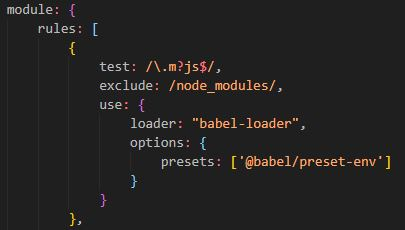

# Proyecto_DW_F2

---

## Índice

1. [Mockups de la Aplicación](#id1)
2. [Instalación de Webpack, Web Dev Server y Babel](#id2)
3. [Instalación de Bootstrap](#id3)

## Mockups de de la Aplicación<a name="id1"></a>

---

## Instalación de Webpack, Web Dev Server y Babel<a name="id2"></a>

### Instalación de Webpack

Como primer paso, vamos a tener la siguiente estructura de nuestro proyecto:


Inicialicaremos npm en nuestro proyecto para poder tener nuestro package.json con el comando:

```text
npm init -y
```

Este comando nos dejará como resultado un json en el que tendremos la estructura base del proyecto
(información del proyecto, scripts, dependencias, etc.).

Instalaremos las librería que nos dejaran comenzar a trabajar con Webpack, ademas de que le indicaremos que
son dependencias de desarrollo con el flag `-D`

```text
npm i -D webpack webpack-cli html-webpack-plugin
```

Creamos un nuevo archivo en la raíz, al cual llamaremos `webpack.config.js`, en el cual definiremos el input
y el output:


Importamos el plugin HtmlWebpackPlugin para poder usar HTML en el proyecto y lo agregamos a la parte de plugins:


Cabe recalcar que le indicamos cual es el HTML de entrada, además de indicarle nombre del template que estará creando

Como le indicamos que usará un `index.html`, lo creamos dentro de la carpeta src, el cual tendrá un estructura básica,
tal cual como esta:


En el archivo `package.json` creamos un apartado para los scripts, en el, insertamos un nuevo script con el comando
`"build": "webpack --mode production"`, este será para generar el bundle de webpack.


### Instalación de Web Dev Server

Vamos a instalar las dependencias de desarrollo para Web Dev Server con el siguiente comando:

```text
npm i -D webpack-dev-server
```

Como siguiente paso, agregamos las dependencias al config de Webpack:


Le estamos indicando con `contentBase` indicamos la carpeta en la que se va a iniciar el server local con `__dirname` y
con `dist`, indicamos la carpeta del código final para la distribución.

También agregamos el script nuevo para iniciar el server local:


Este comando nos deja iniciar el server, y se abrirá un archivo en el navegador predeterminado, siempre que hagamos un cambio,
lo veremos reflejado automaticamente.

### Instalación de Babel

Instalamos las dependencias de Desarrollo de Babel en el proyecto:

```text
npm i -D @babel/core @babel/preset-env babel-loader
```

Agregamos el loader necesario para poder trabajar con las dependencias:



En este loader, indicamos que cada vez que babel encuentre un archivo JavaScript, pasará por Babel, excluyendo la carpeta `node_modules`.

Creamos un archivo nuevo en la raíz, llamado `babel.config.json`, en el que indicaremos el preset que vamos a usar:


---

## Instalación de Bootstrap<a name="id3"></a>

Para comenzar, instalamos las dependencias que nos permitirán trabajar con Bootstrap:

```text
npm install bootstrap
```

Dentro de `./src` creamos una carpeta `JS` y al mismo tiempo, dentro de la carpeta, un archivo `index.js`. Ahí, importaremos boostrap para usar
su CSS y los scripts que nos permitirán tener las funcionalidades de Boostrap:


Como siguiente paso, insertamos el loader necesario en la config de webpack:


Como vemos, usaremos solamente CSS, así que solo insertamos el loader necesario, en este caso, son dos: `style-loader`, el cual nos
permite usar CSS en el DOM de HTML y el loader `css-loader`, el cual, nos permite interpretar métodos como `@import` y `url()`

Para poder probar que funciona Bootstrap, insertaremos en el `index.html` un componente, decidimos usar un navbar para poder ver
que se están poniendo los estilos bien y que las funcionalidades, como los menús desplegables, están funcionando de manera
correcta.

Echamos a andar el proyecto y vemos el resultado en el navegador:


Y vemos que además de los estilos, podemos ver que los scripts también funcionan de manera correcta:


